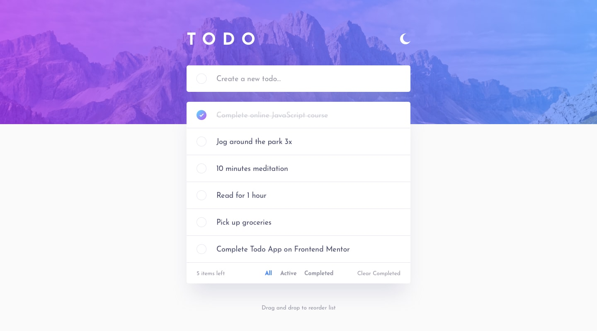
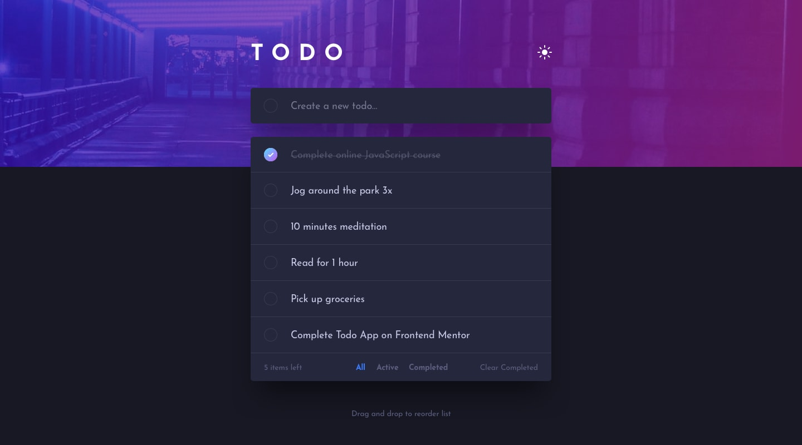
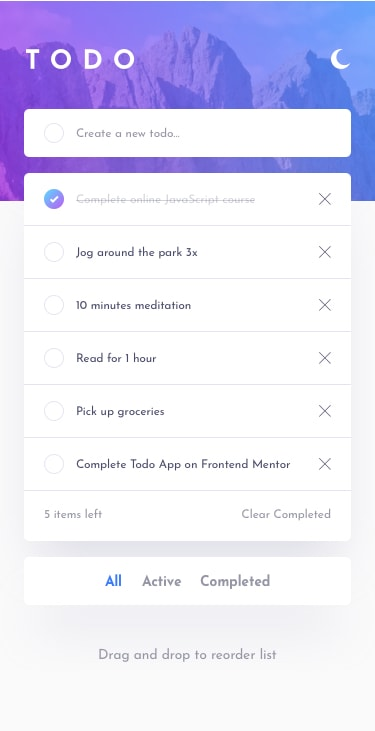
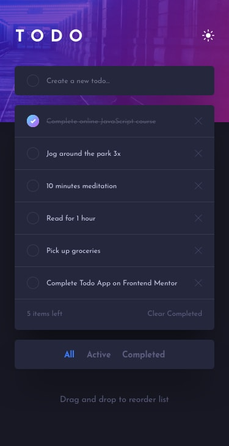

# Frontend Mentor | Todo app

A responsive todo app built as a solution to the [Todo app challenge on Frontend Mentor](https://www.frontendmentor.io/challenges/todo-app-Su1_KokOW). Built with **Vite**, **vanilla JavaScript (ES modules)** and **Sass**.

## Table of contents

- [Overview](#overview)
  - [The challenge](#the-challenge)
  - [Screenshots](#screenshots)
  - [Links](#links)
- [My process](#my-process)
  - [Built with](#built-with)
  - [Project structure](#project-structure)
  - [What I learned](#what-i-learned)
  - [Useful resources](#useful-resources)
- [Getting started](#getting-started)
- [Author](#author)
- [Acknowledgments](#acknowledgments)

## Overview

### The challenge

Users should be able to:

- [x] View the optimal layout for the app depending on their device's screen size
- [x] See hover states for all interactive elements on the page
- [x] Add new todos to the list
- [x] Mark todos as complete
- [x] Delete todos from the list
- [x] Filter by all / active / completed todos
- [x] Clear all completed todos
- [x] Toggle light and dark mode
- [x] **Bonus:** Drag and drop to reorder items on the list

**Extras I added:**

- Theme choice is saved, follows the OS setting by default, and loads with no flash
- Todos persist in `localStorage`
- Keyboard reordering with `Alt + ↑ / ↓`
- Touch-friendly drag and drop (short press-and-hold so scrolling still works)
- Accessible markup: real checkboxes, labels, `aria-live` item counter, visible focus states

### Screenshots

|                   Desktop (light)                   |                  Desktop (dark)                   |
| :-------------------------------------------------: | :-----------------------------------------------: |
|  |  |

|                  Mobile (light)                   |                  Mobile (dark)                  |
| :-----------------------------------------------: | :---------------------------------------------: |
|  |  |

> Add your screenshots to a `screenshots/` folder with the file names above (or update the paths).

### Links

- Solution URL: [https://github.com/Mohamedmostafa110/Frontend-Mentor-Todo-app](https://github.com/Mohamedmostafa110/Frontend-Mentor-Todo-app)
- Live Demo: [ADD YOUR LIVE DEMO LINK HERE](https://your-live-demo-url.com)

## My process

### Built with

- Semantic HTML5 markup
- [Sass](https://sass-lang.com/) (partials, variables, mixins)
- CSS custom properties for light/dark theming
- CSS Flexbox and Grid
- Mobile-first workflow
- JavaScript (ES modules, no framework)
- [Vite](https://vitejs.dev/) as the bundler
- [SortableJS](https://github.com/SortableJS/Sortable) for drag and drop
- [Fontsource](https://fontsource.org/) (Josefin Sans, self-hosted)

### Project structure

```
├── index.html
├── vite.config.js
├── public/images/        # assets from the starter
└── src/
    ├── main.js           # entry point, wires up events
    ├── js/
    │   ├── store.js      # state + actions (add, toggle, remove, filter, reorder)
    │   ├── render.js     # DOM rendering
    │   ├── theme.js      # light / dark toggle
    │   ├── dnd.js        # drag and drop (SortableJS)
    │   └── storage.js    # localStorage helpers
    └── scss/
        ├── _variables.scss
        ├── _themes.scss
        ├── _base.scss
        ├── _header.scss
        ├── _todo.scss
        └── main.scss
```

### What I learned

- Splitting the app into a small **store** (state and actions) and a **render** function that redraws from that state keeps the logic easy to follow and test.
- Theming with **CSS custom properties** on `[data-theme]` means the Sass only describes the layout once, and light/dark just swap the variables.
- Reordering a **filtered** list needs care: hidden items must keep their own slots, so only the visible items are re-ordered.
- Using **event delegation** on the list keeps the listeners simple even as todos are added and removed.
- Setting the theme in a tiny inline script before first paint avoids the "flash of the wrong theme".

```js
// Reorder only the visible todos; hidden ones keep their slots
export function reorderVisible(orderedIds) {
  const visible = new Set(orderedIds);
  const slots = [];
  todos.forEach((t, i) => visible.has(t.id) && slots.push(i));

  const byId = new Map(todos.map((t) => [t.id, t]));
  const next = [...todos];
  orderedIds.forEach((id, k) => {
    next[slots[k]] = byId.get(id);
  });

  todos = next;
  commit();
}
```

### Useful resources

- [Vite docs](https://vitejs.dev/guide/) - project setup and build
- [Sass docs](https://sass-lang.com/documentation/) - `@use`, mixins and partials
- [SortableJS](https://github.com/SortableJS/Sortable) - drag and drop options
- [MDN: CSS custom properties](https://developer.mozilla.org/en-US/docs/Web/CSS/Using_CSS_custom_properties) - theming approach

## Getting started

Requirements: [Node.js](https://nodejs.org/) 18 or newer.

```bash
# 1. Clone the repository
git clone https://github.com/Mohamedmostafa110/Frontend-Mentor-Todo-app.git
cd Frontend-Mentor-Todo-app

# 2. Install dependencies
npm install

# 3. Start the dev server
npm run dev

# 4. Build for production (output in /dist)
npm run build

# 5. Preview the production build
npm run preview
```

## Author

- GitHub - [@Mohamedmostafa110](https://github.com/Mohamedmostafa110)
- Frontend Mentor - [@YourUsername](https://www.frontendmentor.io/profile/YourUsername)

## Acknowledgments

Thanks to [Frontend Mentor](https://www.frontendmentor.io) for the challenge and the design files.
